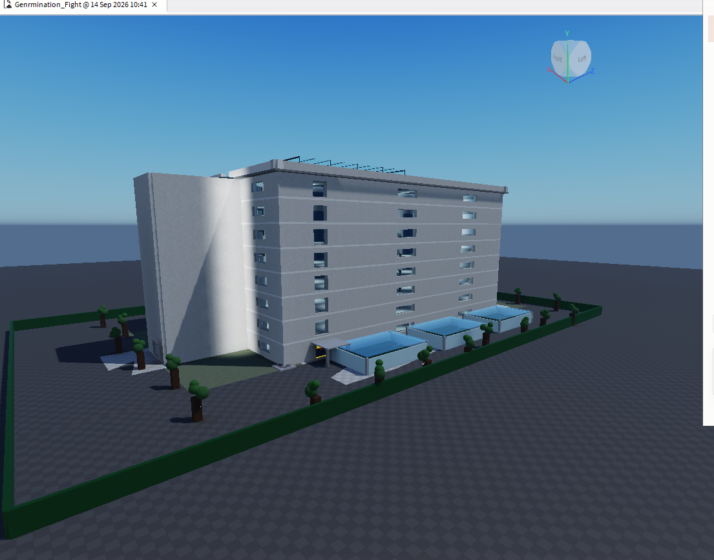
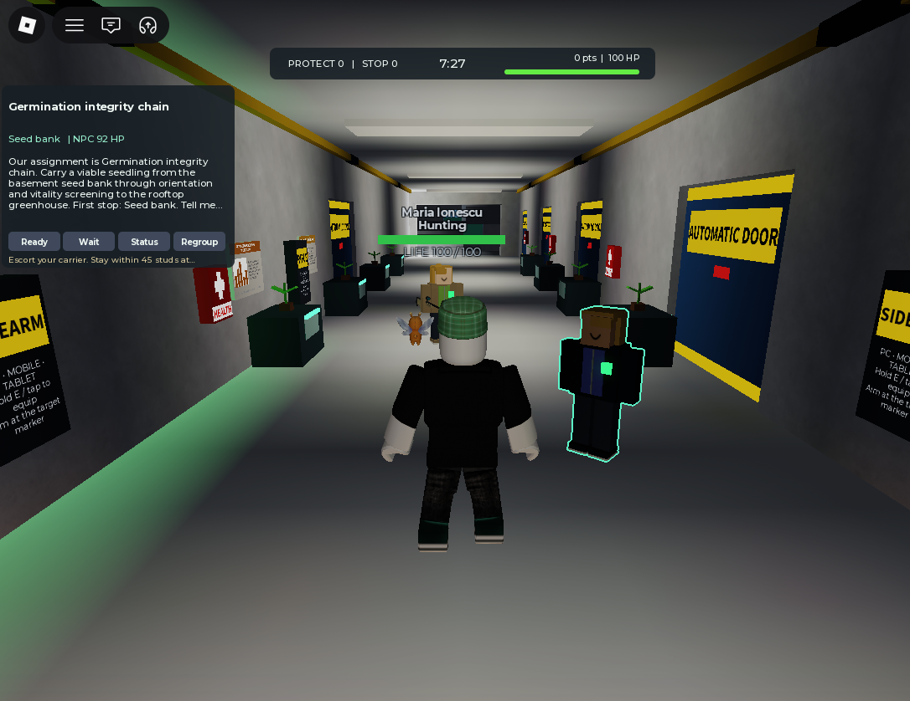
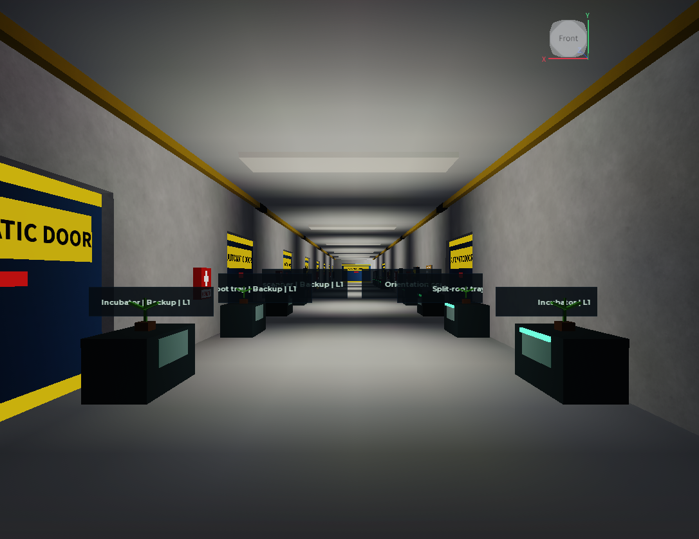
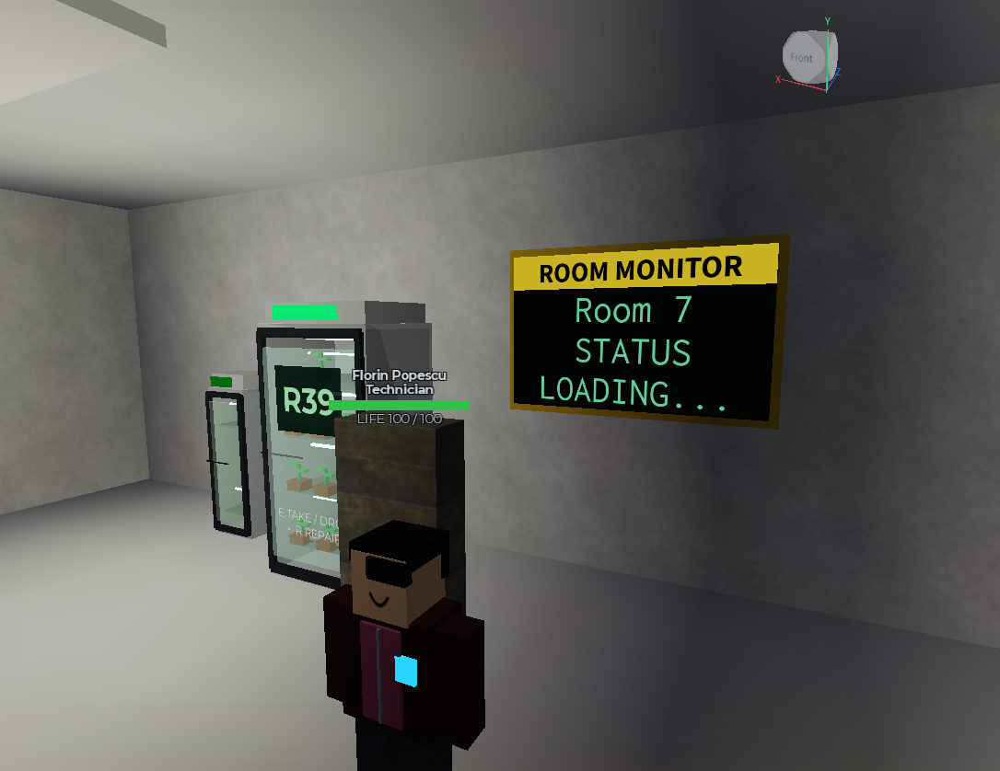
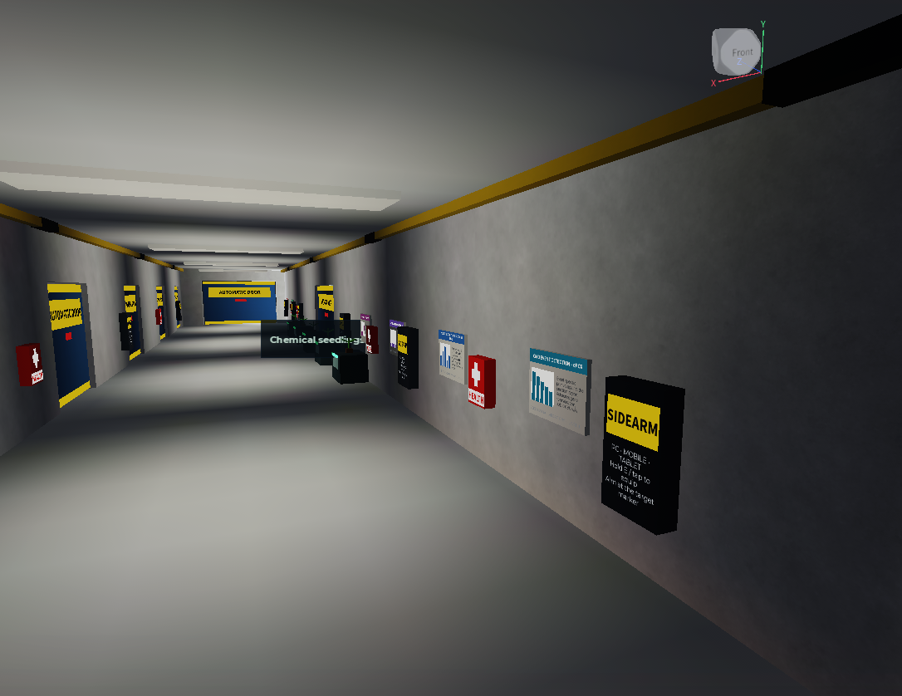
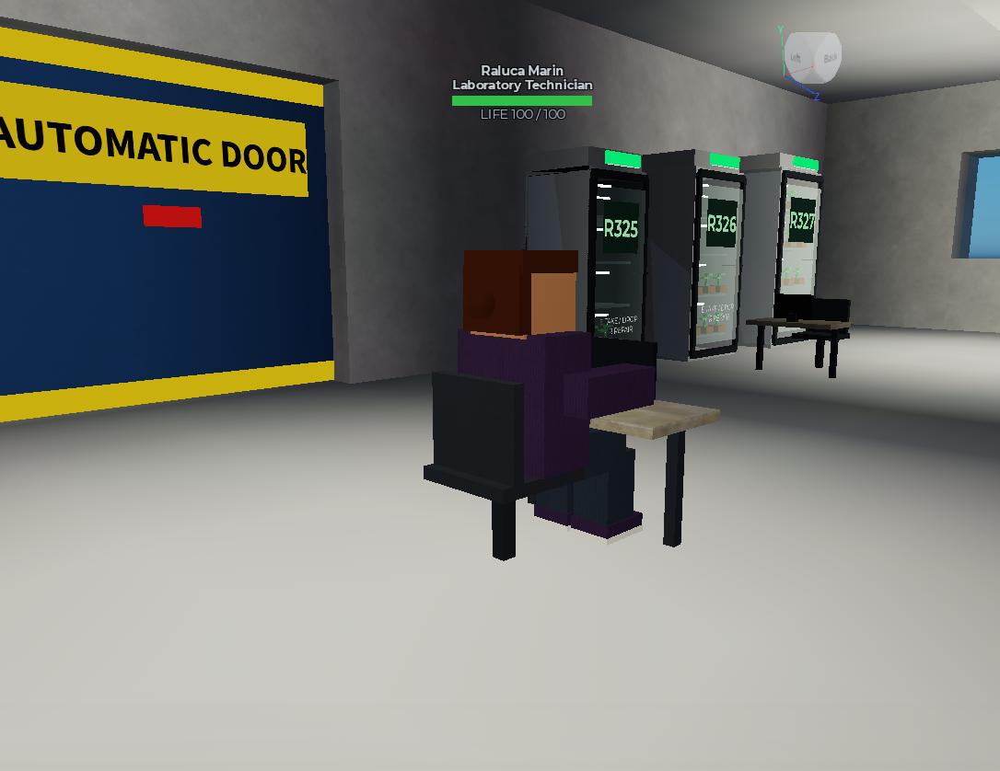
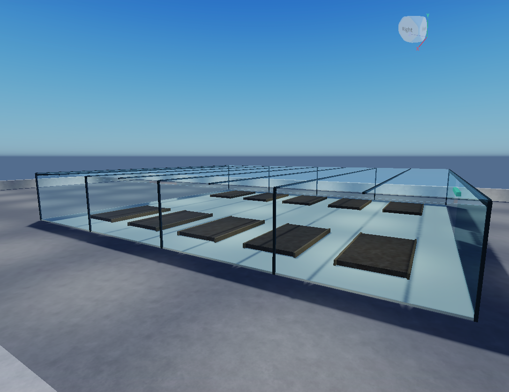
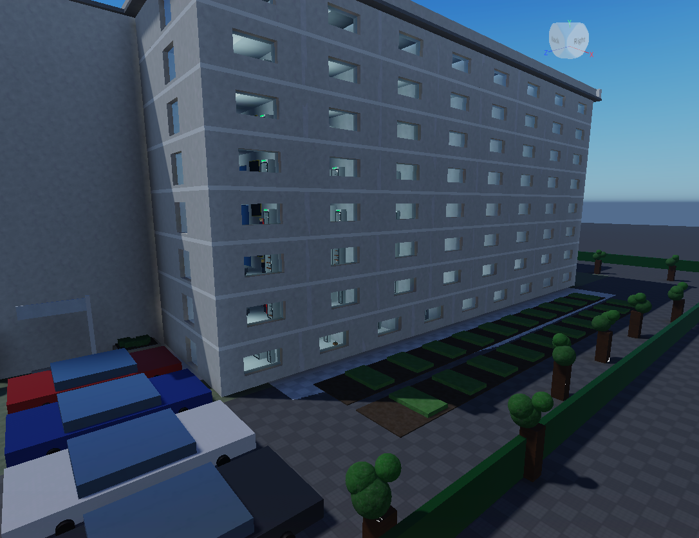
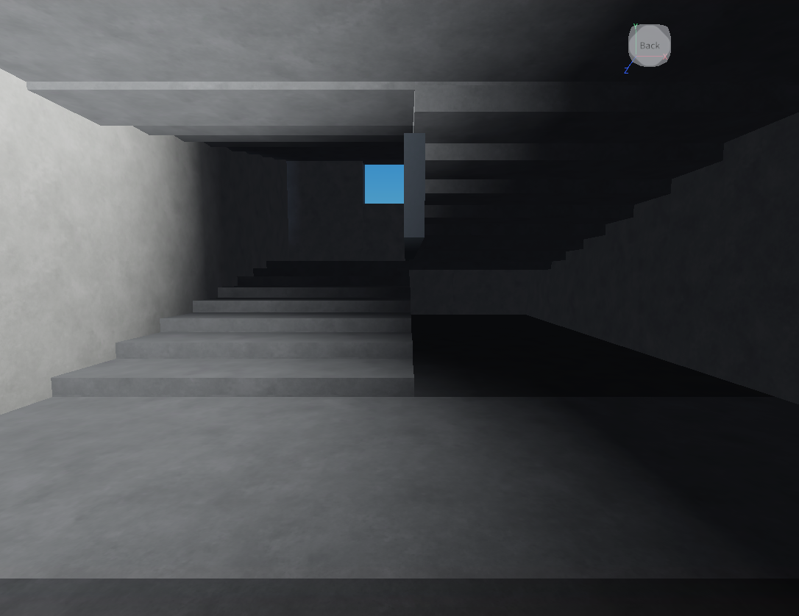

# Genrmination_Fight

**[▶ Play Genrmination_Fight on Roblox](https://www.roblox.com/games/137098589879404/Genrmination-Fight)**

A Roblox experience: a procedurally generated, nine-storey plant-research
laboratory in which two roles compete over a research carrier NPC. One escorts
it from the basement seed bank to the rooftop greenhouse; the other tries to
stop it before it plants.

## The experience

| | |
|---|---|
| Name | **Genrmination_Fight** |
| Play | https://www.roblox.com/games/137098589879404/Genrmination-Fight |
| Creator | [@mihaiionitaedu](https://www.roblox.com/users/11633373577/profile) |
| Universe ID | `10765868470` |
| Root place ID | `137098589879404` |
| Max players | 50 |
| Created | 10 September 2026 |



## What you do

A research carrier NPC has to walk a seedling from the **seed bank in the
basement**, through five instrument stations spread across the floors, up to the
**rooftop greenhouse**, and plant it. That takes most of an eight-minute shift.

Choosing a role chooses your side. There is no mission menu — pick a kiosk and
the assignment is issued immediately.

| Role | Objective | Scoring |
|---|---|---|
| **Technician** | Escort the carrier and keep it alive | +15 per checkpoint held within 45 studs, +60 for the rooftop planting |
| **Laboratory Technician** | Stop the carrier before it plants | +50 for bringing it down |

Firing any weapon costs 1% of your score, and so does every hit you take —
proportional, so it bites hardest when you are ahead.



The mission panel names the assignment, the current stop and the carrier's
health. The green line on the floor is the route. The worker on the right is a
live ambusher; its label reads **Hunting**.

### The building is not neutral

One hundred and eighty laboratory workers go about a shift routine until you
walk past. Then rooms open and send people after you.

- At most **five** are armed at once. Put one down and a room further along your
  route releases a replacement.
- They **hold a firing line** — never closer than 15 studs, so you can aim at them.
- Each fires once every ten seconds, accurately, for half a health point.
- They will shoot the **gas lines and machinery beside you** instead of you, and
  **shoot out the greenhouse glass** to open a line.
- Half of every ambush goes for the **carrier**, not for you. Escorting is a real job.

Emergency kits line every corridor on a 25-second recharge, so sustained fire is
survivable if you keep moving.

## The world



Nine levels — a basement and eight floors — each a central corridor with rooms
either side, linked by two stair towers running the full height. There are no
elevators, so the towers are both the only way up and the obvious place to be
ambushed.



Rooms hold the 450 germination chambers. Every one is destructible: shoot it and
it explodes, killing workers within 17 studs and hurting you too. Only a
Technician can repair one, by holding **R**.



Corridors carry the emergency kits, the weapon cabinets, the scientific posters
that take permanent bullet holes, and the yellow gas line near the ceiling —
which is live ordnance.



Forty-five of the workers are seated desk staff. They never patrol and never
join an ambush, but they are still targets.



The rooftop greenhouse is where both assignments end. Ten planting plots sit
under the glass, twelve seedlings each. The glass breaks.



Outside: a fenced compound with a vehicle gate, parking, glasshouses on the
western apron, trial plots to the east, and twenty-eight trees.



In the basement floor, at **X = 110, Z = 130**, there is a dark diamond-plate
hatch with a gold glow ring. Hold **E** for 1.2 seconds and it drops you into a
sealed lounge beneath the building, where the lab systems stop.

## Weapons

Three, each costing 1% of your score per shot. A worker has 100 health, and a
head shot doubles damage rather than killing outright.

| Weapon | Damage | Pellets | Range | Cooldown | Shots to kill |
|---|---|---|---|---|---|
| Lab Sidearm | 34 | 1 | 240 | 0.32 s | 3 |
| Lab Shotgun | 12 | 6 | 110 | 0.85 s | 2 |
| Lab Rifle | 55 | 1 | 620 | 0.95 s | 2 |

The sidearm cycles fastest and stays accurate while moving. The shotgun's 72
damage assumes every pellet connects, which holds only inside about twenty
studs. The rifle is the corridor and stairwell weapon — 620 studs covers the
full length of any floor.

More photographs, the full design record and ten tactics worth knowing are in
[`docs/Genrmination_Fight.pdf`](docs/Genrmination_Fight.pdf).

## What is here

| Path | Contents |
|---|---|
| `src/` | The 23 scripts installed in the live place, exactly as they run — ReplicatedStorage modules, ServerScriptService scripts, StarterPlayer client scripts, and the two server-only documentation modules. |
| `generator/` | `SeedLabGenerator.lua`, the single file that builds the entire world: 61,694 parts, nine levels, two stair towers, the rooftop greenhouse, the site works and 180 worker NPCs. |
| `docs/` | The LaTeX book and the compiled 826-page PDF, including 13 photographs taken from the running game. |
| `export/` | `Export.gltf` — the geometry export, for viewing the world outside Roblox. |
| `records/` | The Revision 5 engineering record and the build scripts that produced the installed source. |

## The world in numbers

| | |
|---|---|
| Parts | 61,694 |
| Levels | basement plus eight floors |
| Worker NPCs | 180 (45 seated desk staff) |
| Germination chambers | 450 |
| Research stations | 67 — 20 capabilities with two backups each, plus 10 rooftop plots |
| Automatic doors | 162 |
| Health kits / weapon cabinets | 90 / 90 |
| Gas lines | 18 |
| Round length | 480 seconds |

## Rebuilding the world

`SeedLabGenerator.lua` is authoring-time only. Run it in Studio in **Edit** mode:

```lua
-- serve the folder locally first:
--   python -m http.server 8765 --directory <this repo> --bind 127.0.0.1
local HttpService = game:GetService("HttpService")
HttpService.HttpEnabled = true
local src = HttpService:GetAsync("http://127.0.0.1:8765/generator/SeedLabGenerator.lua", true)
loadstring(src)()
HttpService.HttpEnabled = false
```

`readfile` is unavailable in Studio and `Script.Source` is capped at 200,000
characters, which is why the transfer goes over localhost HTTP and why the
documentation modules are split in two.

## Building the documentation

Requires LuaLaTeX with the DejaVu fonts.

```sh
cd docs && ./compile.sh
```

Delete `*.aux`, `*.out` and `*.toc` first if the chapter list has changed —
stale bookmark entries cause `! File ended while scanning use of \BKM@entry`.

## Rules for anyone — human or AI — modifying this game

These are not style preferences. Each one is a fault that has already cost this
project a working build, and each is recorded with its evidence in
`records/revision-5-record.md`.

1. **Never compose a global coordinate frame from a landmark part.** A previous
   revision derived a frame from the roof, concluded the building had not moved,
   and migrated the wrong object. The ground plane ended up 15.25 studs above the
   first floor.
2. **Never store world coordinates in gameplay code.** Resolve positions at
   runtime from the `RoomIndex` attribute, CollectionService tags, or instance
   lookup. The carrier walked through walls for weeks because its route was a
   hardcoded polyline.
3. **Fixes belong in the generator as well as the installed scripts.** The
   installed scripts are its output; a rebuild reverts anything changed only in
   the place.
4. **Declare locals above every function that names them.** A `local` declared
   after a function that references it resolves to a nil global and silently
   kills the thread. This has happened five times here.
5. **Verify with a numeric scene query, not a single play-through.** One mission
   completing proves nothing about 81 rooms across nine floors.
6. **Do not transform live instances.** If unavoidable, make the transform
   idempotent and assert that a known part lands where expected before touching
   anything else.

## Licence

None chosen yet. Without a licence, default copyright applies and others may not
reuse the code.

## Credits

Built iteratively with AI assistance (Claude and ChatGPT) by the repository
owner. The engineering record in `records/` and `docs/` documents what each
revision changed, what broke, and how it was diagnosed.
